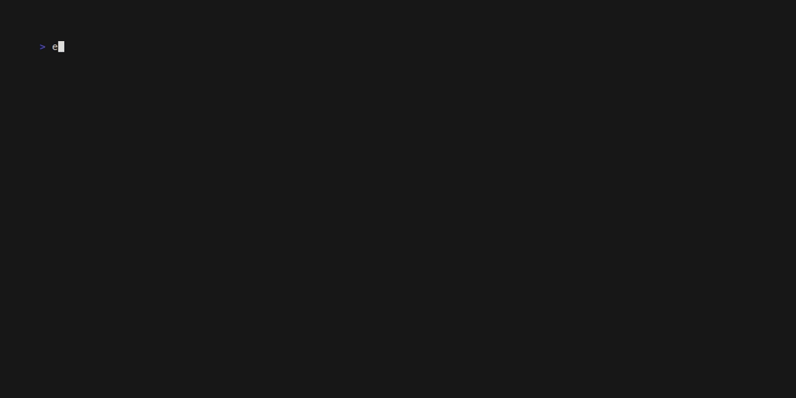

# TermOS

<p align="center">
  
</p>

<p align="center">
  
</p>

A terminal multiplexer and window manager, ported to Rust from
[TUIOS](https://github.com/Gaurav-Gosain/tuios). Built with
[ratatui](https://github.com/ratatui-org/ratatui),
[crossterm](https://github.com/crossterm-rs/crossterm), and
[nix](https://github.com/nix-rust/nix).

## Features

- **Modal TUI** — vim-like window-management and terminal modes with
  tmux-style leader prefixes (`Ctrl+B`)
- **BSP tiling** — binary space partition layout with master-stack and
  scrolling modes
- **Floating panes** — drag, resize, and pin windows above the tiled layout
- **Multi-workspace** — up to 9 workspaces with `Alt+1-9` switching
- **VT emulation** — full ANSI/VT100 parser with scrollback, alternate
  screen, OSC 52 clipboard, and mouse support
- **Vim copy mode** — char search (`f`/`F`/`t`/`T`), word motions
  (`w`/`b`/`e`), regex search (`/`/`?`/`n`/`N`), visual selection (`v`/`V`)
- **Mouse interaction** — border-drag resize, double/triple-click select
  (word/line), auto-copy on release
- **Command palette** — fuzzy-search all commands with `Ctrl+B P`
- **21 built-in themes** — dracula, catppuccin, gruvbox, nord, tokyo-night,
  solarized, and more, with accent color customization
- **Tape scripting** — record and replay terminal automation with a
  secure per-machine trust store
- **Graphics passthrough** — Kitty graphics protocol and Sixel forwarding
  with placement tracking (no rasterization)
- **Session daemon** — Unix-socket daemon for session persistence and
  multi-client attach
- **Hooks** — shell-command lifecycle hooks (TOML config)
- **Config hot-reload** — edit `config.toml` and changes apply live
- **Doctor** — `termos doctor` checks config, PTY, daemon, and theme health

## Installation

```bash
# Install from GitHub (recommended)
cargo install --git https://github.com/KidIkaros/termos

# Or build from source
cargo build --release
# Binary at target/release/termos
```

## Quick Start

```bash
# Run the TUI
termos

# With CLI overrides
termos --theme dracula --ascii-only

# Start a session daemon
termos daemon &

# Create and attach a session
termos run my-session
termos attach my-session

# Play a tape
termos tape play examples/demo.tape

# Health check
termos doctor
```

## Keybindings

| Key | Mode | Action |
|-----|------|--------|
| `Ctrl+B` | Any | Leader prefix |
| `c` | WM | New window |
| `x` | WM | Close window |
| `n` | WM | Next window |
| `h/j/k/l` | WM | Focus window |
| `H/J/K/L` | WM | Swap window |
| `Space` | WM | Next window |
| `z` | WM | Toggle zoom |
| `-` / `\|` | WM | Split horizontal / vertical |
| `P` | WM | Command palette |
| `?` | WM | Help overlay |
| `1-9` | Any | Switch workspace |
| `i` / `Enter` | WM | Enter terminal mode |
| `Escape` | Terminal | Back to WM mode |
| `[` | Terminal | Enter copy/scrollback mode |
| `q` | WM | Quit |

See [docs/KEYBINDINGS.md](docs/KEYBINDINGS.md) for the full reference.

## Configuration

TermOS reads `~/.config/termos/config.toml`. Create it with:

```bash
termos doctor  # checks config and shows what's missing
```

See [docs/CONFIGURATION.md](docs/CONFIGURATION.md) for all options.

## Architecture

The codebase is split into focused modules:

| Module | Lines | Purpose |
|--------|-------|---------|
| `app/mod.rs` | 2,816 | Os struct, damage, window ops, layout |
| `app/types.rs` | 744 | Mode, Prefix, Command, Workspace |
| `app/tape_ops.rs` | 914 | Scripting, recording, tape manager |
| `app/agent_ops.rs` | 506 | Hooks, agent state, alerts |
| `app/ui_ops.rs` | 2,180 | Palette, switcher, overlays, dialogs |
| `app/tests.rs` | 3,148 | Unit tests |
| `vt/` | 8,409 | VT100/ANSI emulator |
| `terminal/` | 3,985 | PTY management, window I/O |
| `layout/` | 2,200 | BSP tiling, master-stack, scrolling |
| `session/` | 11,616 | Daemon, persistence, remote protocol |
| `config/` | 5,931 | User config, themes, keybindings |

See [docs/ARCHITECTURE.md](docs/ARCHITECTURE.md) for the full module map.

## Network Modes (optional)

```bash
# Build with network support
cargo build --release --features network

# SSH server
termos --network ssh --host-key ~/.ssh/termos_host_key

# Web terminal
termos --network web --addr 0.0.0.0:8080
```

## Testing

```bash
cargo test                            # 2128 tests
cargo test --features network         # with network tests
cargo clippy --all-targets            # lint
cargo test --test vt                  # VT conformance
cargo test --test daemon              # session management
```

## License

MIT
