# Dependency Graph for `TermOS`

```mermaid
flowchart TD

1[src/main.rs]
1 --> 2
1 --> 3
1 --> 4
1 --> 5
1 --> 6
1 --> 7
1 --> 8
1 --> 9
1 --> 10
1 --> 11
1 --> 12
1 --> 13

2[src/app]
2 --> 3
2 --> 14
2 --> 15
2 --> 16
2 --> 6
2 --> 17
2 --> 7
2 --> 9
2 --> 10
2 --> 18
2 --> 19
2 --> 20
2 --> 21
2 --> 22
2 --> 23

3[src/config]
3 --> 24
3 --> 12

4[src/hooks]
4 --> 2
4 --> 3
4 --> 16
4 --> 25
4 --> 7
4 --> 19

14[src/layout]
14 --> 3

15[src/terminal]
15 --> 3
15 --> 16
15 --> 6
15 --> 25
15 --> 9
15 --> 19
15 --> 30

5[src/network]
5 --> 2
5 --> 3
5 --> 7
5 --> 18
5 --> 26
5 --> 27
5 --> 28

6[src/ui]
6 --> 9
6 --> 11

16[src/session]
16 --> 3
16 --> 15
16 --> 9
16 --> 25
16 --> 19
16 --> 30

7[src/tape]
7 --> 9
7 --> 19
7 --> 20

17[src/vt]
17 --> 19
17 --> 31
17 --> 20
17 --> 32
17 --> 33
17 --> 34

24[dirs]
24 --> 35
24 --> 36

25[src/terminal/pty]
25 --> 19
25 --> 31
25 --> 20
25 --> 32
25 --> 33
25 --> 34

9[ratatui]
9 --> 19
9 --> 20
9 --> 51
9 --> 38
9 --> 39
9 --> 34

10[crossterm]
10 --> 9
10 --> 20

18[nix]
18 --> 41
18 --> 54
18 --> 55

19[crossbeam-channel]
19 --> 20

20[toml]
20 --> 64
20 --> 65
20 --> 66
20 --> 67

21[uuid]
21 --> 41

11[serde]
11 --> 48
11 --> 47

22[sysinfo]
22 --> 69
22 --> 70
22 --> 41

23[sha2]
23 --> 41

26[russh]
26 --> 73
26 --> 75
26 --> 76
26 --> 77

27[axum]
27 --> 38
27 --> 43

28[rustls]
28 --> 41

31[unicode-width]
31 --> 60

32[regex]
32 --> 61

33[libc]
33 --> 41

34[log]
34 --> 53

35[dirs-sys]
35 --> 36

36[winapi-util]

38[http]
38 --> 41

39[mio]
39 --> 41

41[libc-sys]

43[tokio]
43 --> 38
43 --> 41

44[tower]

45[tower-http]

46[hyper]

47[serde_json]
47 --> 11

48[serde_derive]

49[clap]
49 --> 46

50[clap_derive]

51[ratatui-core]

52[tracing]
52 --> 53

53[tracing-subscriber]

54[signal-hook]
54 --> 41

55[errno]

56[unicode-segmentation]
56 --> 20

57[windows-sys]

58[ahash]

59[no-panic]

60[unicode-width-tables]

61[regex-automata]
61 --> 62

62[regex-syntax]

63[memchr]

64[toml_edit]
64 --> 67
64 --> 65

65[toml_datetime]

66[toml_write]

67[winnow]
67 --> 64
67 --> 65

68[lock_api]

69[sysinfo-core]
69 --> 68

70[ntapi]

71[winapi]

72[once_cell]

73[russh-crypt]
73 --> 74

74[russh-keys]
74 --> 75
74 --> 76

75[ring]
75 --> 41

76[zeroize]

77[bcrypt-pbkdf]
77 --> 72

78[aws-lc-rs]

79[webpki-roots]

```

> **Note:** This is a simplified dependency graph. The actual graph is generated
> from `Cargo.lock` and includes transitive dependencies. Key crates:
>
> - **ratatui** — TUI rendering
> - **crossterm** — terminal I/O
> - **nix** — PTY management
> - **crossbeam-channel** — cross-thread communication
> - **toml** — configuration
> - **sha2** — tape trust store hashing
> - **russh** (optional, `network` feature) — SSH server
> - **axum** (optional, `network` feature) — web server
> - **rustls** (optional, `tls` feature) — TLS
